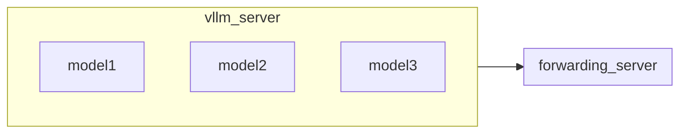

这里是一个使用express搭建的转发服务器.

```mermaid
flowchart LR
    subgraph vllm_server
        model1
        model2
        model3
    end
    subgraph forwarding_server
    end
    vllm_server-->forwarding_server
```

vllm_servers使用固定范围的端口, 默认从12340~12350
